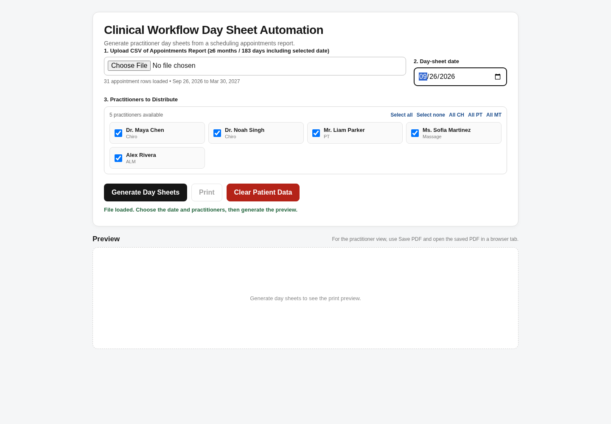
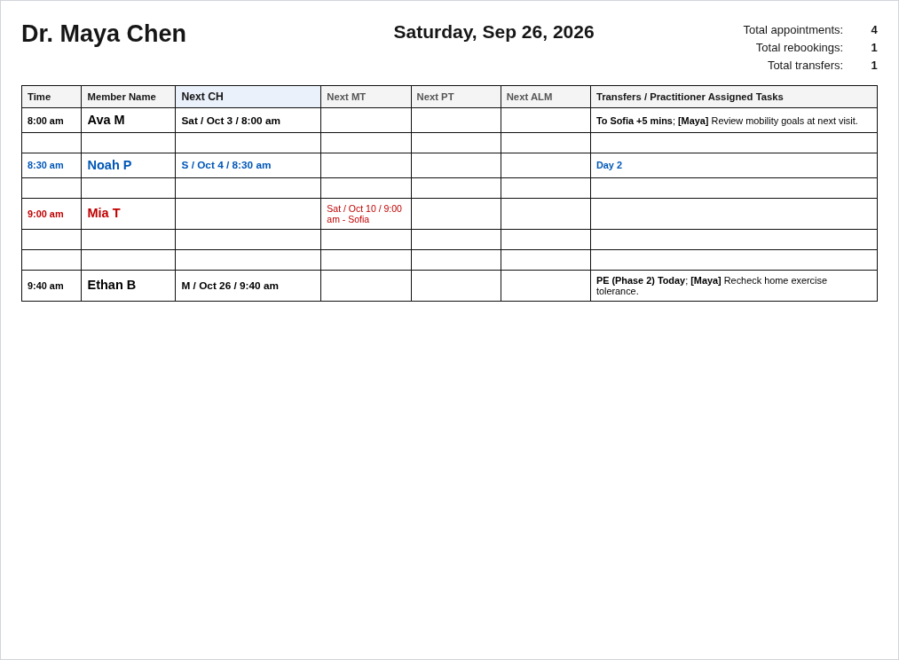

# Clinical Workflow Day Sheet Automation

A browser-based healthcare operations tool that converts appointment-export CSV data into structured practitioner day sheets.

This repository is a **sanitized portfolio version** of a system developed for real-world clinic operations. All clinic branding, staff identities, contact information, and patient data have been removed. The included CSV contains **synthetic demo data only**.

## Problem

Preparing daily practitioner schedules manually required repeated review of appointment data, future bookings, transfers, schedule gaps, and follow-up needs.

## Solution

The application imports an appointment CSV and automatically generates practitioner-specific day sheets with:

- automatic CSV column detection
- practitioner-specific schedules
- next-appointment lookups across disciplines
- transfer / handoff detection
- treatment-stage markers and follow-up indicators
- schedule-gap visualization
- appointment-state filtering and duplicate handling
- input validation and report-coverage checks
- print / PDF-ready day sheets
- optional email composition workflow

## Impact

In production use, the workflow reduced a process that previously took approximately **1 hour per day to under 2 minutes**, representing roughly **250 staff hours of potential annual time savings**.

The production version was adopted for clinic operations, and the development work was compensated.

## Privacy by Design

The application runs entirely in the browser. It does not require a backend server or database for CSV processing.

The portfolio build also:

- uses only synthetic demonstration data
- contains no real patient information
- contains no real staff names or email addresses
- removes clinic branding
- minimizes imported fields after the required columns are identified
- does not persist patient data between sessions
- includes a restrictive Content Security Policy to limit network access

## Tech Stack

- HTML5
- CSS3
- Vanilla JavaScript
- Client-side CSV parsing
- Browser print / PDF workflow

No framework, package manager, or server is required.

## Run the Demo

1. Download or clone the repository.
2. Open `clinical_day_sheet_automation.html` in a modern browser.
3. Upload `sample-data/synthetic_appointments.csv`.
4. Set the day-sheet date to **September 26, 2026**.
5. Select one or more practitioners.
6. Click **Generate Day Sheets**.

The included sample CSV is fictional and exists only to demonstrate the application.

## Screenshots

### Application workflow



### Generated practitioner day sheet



## Repository Structure

```text
clinical-workflow-automation/
├── clinical_day_sheet_automation.html
├── sample-data/
│   └── synthetic_appointments.csv
├── screenshots/
│   ├── app-demo.png
│   └── day-sheet-demo.png
├── .gitignore
└── README.md
```

## Portfolio Notes

This public version is intended to demonstrate workflow automation, client-side data processing, healthcare operations design, and privacy-conscious software development. It is not a production medical record system and should not be used with real patient data.

## Disclaimer

This project is an independent portfolio demonstration and is not affiliated with or endorsed by any scheduling-platform vendor referenced by compatible export formats.
